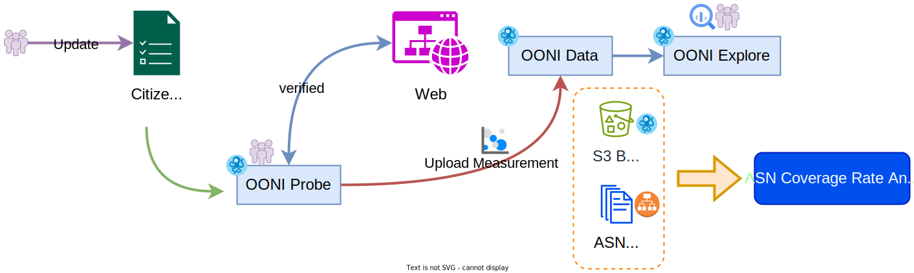

# 各區域觀察資料與 ASN 涵蓋率

- 研究狀態：`進行中`

- 研究主題：主要解析目前 OONI 的觀測資料與各區域已知的 [ASN](https://www.cloudflare.com/zh-tw/learning/network-layer/what-is-an-autonomous-system/) 涵蓋狀況，觀察資料是否平均分散在各區域不同的電信或網路架構中。

- 研究方式：
    1. 透過 OONI Data Mining 的方式建立本地資料庫（AWS S3）與全球已知 ASN 列表清單作初步比對。
    2. 建立線上圖表呈現各區域觀察涵蓋資料。
    3. 後端建立與 OONI Data 即時資料串接。

## 取得 OONI 觀測資料

透過所提供的 AWS S3 bucket([`ooni-data-eu-fra`](https://ooni-data-eu-fra.s3.eu-central-1.amazonaws.com/)) 來取得依地區分類的資料。
- https://ooni.org/post/mining-ooni-data
- https://registry.opendata.aws/ooni/

> [!NOTE]
> 無法使用 `s3cmd` 來取得公開 bucket 的資料，可以改用 [s5cmd](https://github.com/peak/s5cmd) 取得。
