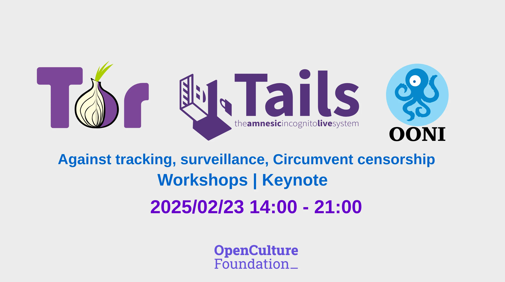

# Internet Freedom Workshop: Tor、Tails、OONI

We are thrilled to invite you to a full-day event dedicated to online privacy, censorship circumvention, and censorship monitoring, hosted in partnership with Open Culture Foundation, the Open Observatory of Network Interference (OONI), and The Tor Project on February 23rd, 2025, in Taipei, Taiwan.

This free pre-event will feature hands-on workshops and a public keynote by Roger Dingledine, co-founder of The Tor Project.

Thie event will feature:

- Two hands-on workshops for journalists, activists, and human rights defenders focused on digital security and censorship resistance.
- A public keynote by Roger Dingledine, co-founder of The Tor Project, on defending online privacy in an era of mass surveillance.

[:material-arrow-right-circle-outline: Register for Event](https://kktix.com/events/internetfreedom-tor-tails-ooni-2025/registrations/new){ .md-button target="_blank" }

!!! info ""

    Please register for the sessions you wish to attend by selecting the appropriate type of ticket. Due to venue limitations, some sessions have a cap on the number of participants, so please register early. The exact location of the event will be announced separately closer to the date.

!!! tip "Recruiting Volunteers"

    We are currently recruiting on-site volunteers for the event and expect to need help from 10 volunteers. If you're available on the day (even if you can't participate the entire time), please register at [OCF Volunteer](https://volunteer.ocf.tw/){target="_blank"}. We plan to begin assigning tasks soon. Thank you!

<!-- more -->

## Workshops

### Workshop 1: Circumventing censorship and navigating anonymously with Tor

- Date: February 23rd at 14:00 - 17:30 (+08:00)
- Capacity: 25 participants
- Language: English
- Facilitators:
      - Raya, Education Coordinator @ The Tor Project
      - Gus, Community Team Lead @ The Tor Project
- Location: National Taipei University of Technology, Taipei Tech

Journalists and human rights defenders often use a single computer for both personal and professional tasks, increasing the risk of data leaks, surveillance, and compromising their confidentiality. This workshop introduces Tails, a secure and portable operating system designed to protect privacy, enable anonymous communication, and ensure digital safety.

What you'll learn:

- How to protect your online identity and data by separating professional and personal activities.
- Installing and configuring Tails on a USB stick for secure online and offline use.
- How Tails integrates with the Tor network for anonymous browsing and communication.

Read more:

- Tails official website: <https://tails.net/>{target="_blank"}
- [Tails: a secure, portable OS to separate professional from personal activities](https://safety.rsf.org/tails-a-secure-portable-os-to-separate-professional-from-personal-activities/){target="_blank"}

[:material-arrow-right-circle-outline: Register for Event](https://kktix.com/events/internetfreedom-tor-tails-ooni-2025/registrations/new){ .md-button target="_blank" }

!!! warning ""

    This workshop reserves spots for partners who are **journalists** and **CSOs members**. Please use your organization's email address when registering.

    Please note that we manually approve applications after registration on KKTIX platform. We conduct basic due diligence checks on participants to ensure a comfortable experience for both trainers and attendees. Participants will be reviewed based on our criteria for this event, prioritizing human rights defenders (HRDs), journalists, and activists.

### Workshop 2: Detecting and Measuring Internet Censorship with OONI

- Date: February 23rd @ 18:00 - 19:00
- Capacity: 25 participants
- Language: English.
- Facilitators:
      - Maria Xynou, Director of Strategic Engagement @ OONI
      - Elizaveta Yachmeneva, Research & Community Coordinator @ OONI
- Location: National Taipei University of Technology, Taipei Tech

In this workshop, participants will gain hands-on experience using OONI (Open Observatory of Network Interference) to detect, monitor, and measure online censorship. Learn how to:

- Identify blocked websites, apps, and services in different regions.
- Use OONI Probe to test internet censorship.
- How to analyze OONI data to track censorship trends.

[:material-arrow-right-circle-outline: Register for Event](https://kktix.com/events/internetfreedom-tor-tails-ooni-2025/registrations/new){ .md-button target="_blank" }

## Keynote

### Keynote: Tor: Defending your online privacy in a surveillance world

- Speaker: Roger Dingledine, Co-founder of The Tor Project
- Date: February 23rd, 2025, @ 19:30 - 21:00.
- Capacity: 120 participants
- Location: Near MRT Songjiang Nanjing Station and Nanjing Fuxing Station.

In this keynote, Roger Dingledine will discuss the growing threats to online privacy, digital surveillance, and internet censorship. He will explore how Tor and Privacy-Enhancing Technologies (PETS) empowers users to navigate the internet anonymously and securely, and why online freedom remains a fundamental human right.

Roger Dingledine is the co-founder of the Tor Project, a nonprofit that develops free and open source software to protect people from tracking, censorship, and surveillance online. He has played a key role in advancing digital rights, supporting journalists, activists, and human rights defenders worldwide.

[:material-arrow-right-circle-outline: Register for Event](https://kktix.com/events/internetfreedom-tor-tails-ooni-2025/registrations/new){ .md-button target="_blank" }
