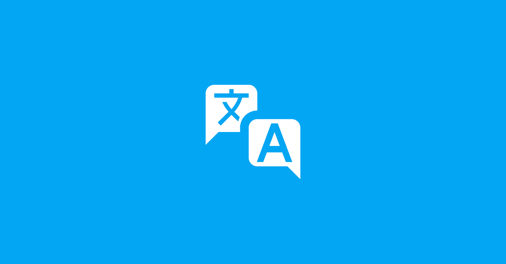

# Anonymous Network Workshop Progress Update

{style="border-radius: 10px;box-shadow:1px 1px 0.6rem #00aeff;"}

We have made some progress and identified areas that require assistance in our "Anonymous Network Workshop" and projects recently, and I wanted to share this with you.

## Anonymous Network Workshop (Preparation)

Last week, we held our second [online meeting](https://pad.anoni.net/p/anoni-workshop){target="_blank"}. With less than two months left until our August event, we have started dividing tasks among staff. We currently have two groups: the Event Team and the Publicity Team. We are using the remaining two months to prepare the event registration page and handle pre-event promotional activities. We are still recruiting staff members and welcome you to sign up and join us in organizing this workshop event.

Additionally, we've successfully completed the translation of the [training presentation](https://docs.google.com/presentation/d/16XWWrSX8DqmZ9uEORiaI-jT0RpquswXFDbzvr6srYjA/edit?usp=drive_link){target="_blank"} needed for the Tor/Tails workshop **(thanks to all the partners involved in the translation, and special thanks to Gus and Zaatar from Tor/Tails)**. Our focus will now shift to training teaching assistants by the end of June. If you happen to have time, you're welcome to join us online. Before participating, you can refer to the "[Self-Assessment Skills Form](../../setup-skill-level.md){target="_blank"}" to find possible answers. We will discuss and resolve them together during the online training sessions.

<!-- more -->

Here are the timings for the online training sessions. Please create calendar reminders for yourself. We will be using the same [online meeting link](https://jitsi.goodmeet.asia/anoni-workshop){target="_blank"} each time. Join us whenever you are available! (Each session is expected to be 90 minutes long)

- 6/14 21:00 Tor L1 ~ L3
- 6/15 13:30 Tails L1 ~ L3
- 6/15 21:00 OONI L1 ~ L3
- 6/21 21:00 Tails L1 ~ L3
- 6/28 13:30 Tor L1 ~ L3
- 6/29 13:30 OONI L1 ~ L3

By the way, during our meeting last week, we discussed that the workshop requires a significant number of USB drives for participants to use on-site. As we currently do not have a process in place to accept monetary donations, we can accept material donations. If you happen to have spare USB drives available, we would greatly appreciate your contribution. **We aim to collect 25 drives.** The drives need to be capable of booting with Tails installed (approximately 1.6 GB).

## Simplified Chinese Language Support

{style="border-radius: 10px;box-shadow:1px 1px 0.6rem #00aeff;"}

"**Initiative**" means you want to make things better, and then you start taking action, eventually bringing everyone together to focus on it and support it, making real change happen. The power of initiatives transcends language. Regardless of the script used, our desire for change is the same, which is why we provide a Simplified Chinese version (zh-CN), hoping to cross language barriers and attract more people to join!

We also observed that approximately 30% of search traffic comes from **Simplified Chinese keywords**, leading to our project page. This is quite an interesting phenomenon. So, aligning with regional needs, we offer suitable content!

For some content, we seek assistance from ChatGPT to modify and add the appropriate context, but we'll primarily base our explanations and discussions on a Taiwanese perspective. If you're interested in extending or developing relevant content in other languages, you're welcome to join our "Anonymous Network" initiative!

Of course, feel free to refer project content to any partners who might need it. Thank you!

- Simplified Chinese Project: <https://anoni.net/docs/zh-cn/>{target="_blank"}

## Open Source and Anonymous Network Roundtable Conference

<figure markdown="span">
  
  <figcaption>Planned schedule for the two-day event.</figcaption>
</figure>

This time we're trying to organize a roundtable discussion format. We need to engage more with our target audience, such as civic groups, news media, independent journalists, and tech communities. If you know partners who are among our future service targets, please help us spread the word about this workshop event and the roundtable discussions. Detailed information can be found on the [preparation page](../../event-workshop-2025-prepare.md){target="_blank"}.

## In Conclusion

The topic of the "**Anonymous Network**" continues to evolve along the lines of "**Internet Freedom**," with personal privacy and online behavior tracking (such as advertising) being ongoing challenges we face. This is not just about confronting these issues but also about raising public awareness on the importance of privacy. The "Anonymous Network" will encompass more facets in the future, whether it's garnering recognition for the topic or training on the infrastructure and tools of anonymous networks. We hope to gradually attract more participation.

Therefore, the workshop activities and roundtable discussions aim to incorporate your vision of the "Anonymous Network" to shape the future of the community!

Thank you for your attention!
