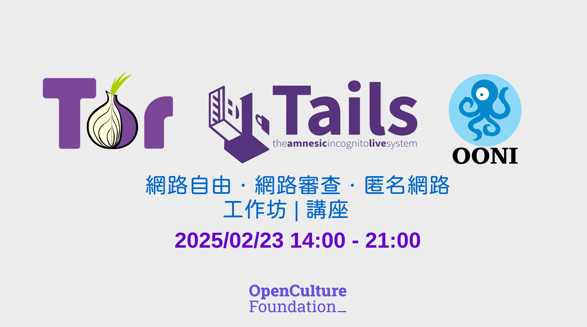

# 網路自由工作坊：Tor、Tails、OONI

!!! note ""

    活動已順利結束，相關的議題討論與簡報可以參考[這篇活動回顧](./rightscon25-tor-tails-ooni-after.md)。

在我們所身處的臺灣，相較於其他國家，我們享有較高的網路自由。然而，我們不能忽視鄰近國家的公民面臨著嚴格的國家監控與網路審查。在這種情況下，如何有效地規避和突破那些阻礙網路自由的高牆，成為許多人關心的議題。

今年，全球最受矚目的人權與數位議題研討會 ─ [RightsCon 2025](https://www.rightscon.org/){target="_blank"}，將在臺灣舉辦。這是一次難得的機會，我們誠摯邀請到來自國際知名組織如 [Tor](https://www.torproject.org/zh-TW/){target="_blank"}、[Tails](https://tails.net/){target="_blank"} 和 [OONI](https://ooni.org/){target="_blank"} 的團隊，在研討會前夕，針對開發者及使用者舉辦一場專業工作坊。這場活動將不僅為參加者提供實際的技術交流機會，也讓我們共同探索如何維護和推動網路自由。歡迎對此議題有興趣的朋友把握機會參加！

活動日期：2025/02/23

1. 工作坊 14:00 – 17:30 如何使用 Tor 避開審查並匿名瀏覽
2. 工作坊 18:00 – 19:00 如何使用 OONI 偵測與觀察網路審查狀況
3. 演講座 19:30 – 21:00 Tor 在網路監控的世界中捍衛個人線上隱私權

[:material-arrow-right-circle-outline: 前往報名頁面](https://kktix.com/events/internetfreedom-tor-tails-ooni-2025/registrations/new){ .md-button target="_blank" }

!!! info ""

    這次活動將有二場工作坊與一場演講，請透過不同票種的方式報名要參加的議程。由於活動場地限制關係，部分議程有人數限制，請盡早報名，活動確切地點將會在活動前另行通知。

!!! tip "招募活動工作人員"

    活動目前招募現場工作人員，預計需要 10 位夥伴的幫忙，當天如果有空（不一定全場參與也沒問題）也請到 [OCF Volunteer](https://volunteer.ocf.tw/){target="_blank"} 登記一下，我們預計將開始分配任務，感謝！

<!-- more -->

## 工作坊

### 工作坊 #1：如何使用 Tor 避開審查並匿名瀏覽

- 日期：2025/02/23 14:00 - 17:30、語言：英文
- 地點：台北科技大學
- 人數：25 人
- 協作者：
      - Raya, Education Coordinator @ The Tor Project
      - Gus, Community Team Lead @ The Tor Project

記者和人權捍衛者（HRDs）經常同時在一台電腦上進行個人與工作的任務，無形當中增加了資料外洩、監控和洩露機敏資訊的風險。本工作坊將介紹 Tails，一種專為保護隱私、支援匿名通訊和確保數位安全而設計的安全且可攜式作業系統（可安裝在 USB 隨身碟或隨身硬碟中）。

您將學到的內容：

- 如何透過分開處理工作與個人活動來保護您的網路線上身份與資料。
- 如何在 USB 隨身碟上安裝並設定 Tails，以便安全地進行線上和離線的操作。
- Tails 如何與 Tor 洋蔥路由網路整合，以實現匿名瀏覽和通訊。

瞭解更多：

- Tails 官方網站：<https://tails.net/>{target="_blank"}
- [Tails：安全、可攜式的作業系統，將工作與個人活動分開。](https://safety.rsf.org/tails-a-secure-portable-os-to-separate-professional-from-personal-activities/){target="_blank"}

[:material-arrow-right-circle-outline: 前往報名頁面](https://kktix.com/events/internetfreedom-tor-tails-ooni-2025/registrations/new){ .md-button target="_blank" }

!!! warning "推薦、保留名額"

    這場工作坊有保留名額給從事**新聞記者**與**公民團體**的夥伴，請注意！在 KKTIX 平台完成註冊此議程後，請稍候，我們會手動審核申請。對參加者進行基本的資格確認，以確保參與者都有一個舒適的體驗。我們將優先考量人權捍衛者（HRDs）、新聞記者相關領域的參與者，請在報名時使用所服務單位的郵件信箱註或其他可證明的方式，非常感謝！

### 工作坊 #2：如何使用 OONI 偵測與觀察網路審查狀況

- 日期：2025/02/23 18:00 - 19:00、語言：英文
- 地點：台北科技大學
- 人數：50 人
- 協作者：
      - Maria Xynou, Director of Strategic Engagement @ OONI
      - Elizaveta Yachmeneva, Research & Community Coordinator @ OONI

在這場工作坊中，參加者將親身體驗使用 OONI（網路干擾開放觀測站）偵測、監控及觀察網路審查。

您將學到的內容：

- 識別不同地區被封鎖的網站、應用程式和服務。
- 使用 OONI Probe 測試網路審查。
- 分析 OONI 資料以追蹤審查情勢狀況。

[:material-arrow-right-circle-outline: 前往報名頁面](https://kktix.com/events/internetfreedom-tor-tails-ooni-2025/registrations/new){ .md-button target="_blank" }

## 講座

### 演講座：Tor 在網路監控的世界中捍衛個人線上隱私權

- 日期：2025/02/23 19:30 - 21:00、語言：英文
- 講者：Roger Dingledine, Co-founder of The Tor Project
- 地點：捷運松江南京站及南京復興站附近

在這場主題演講中，[Roger Dingledine](https://en.wikipedia.org/wiki/Roger_Dingledine){target="_blank"} 將討論日益增長的線上隱私威脅、數位監控和網路審查問題。他將探討 Tor 及隱私增強技術（Privacy-Enhancing Technologies, PETS）如何賦予使用者以匿名及安全地瀏覽網路，並闡述為何網路自由仍然是一項基本人權。

Roger Dingledine 是 Tor Project 的共同創辦人，Tor Project 是一個開發自由且開源軟體的非營利組織，關注在保護人們不受追蹤、審查和監控的影響。他在推動數位權利方面扮演了關鍵角色，支持全球的記者、社運團體及人權捍衛者。

[:material-arrow-right-circle-outline: 前往報名頁面](https://kktix.com/events/internetfreedom-tor-tails-ooni-2025/registrations/new){ .md-button target="_blank" }
