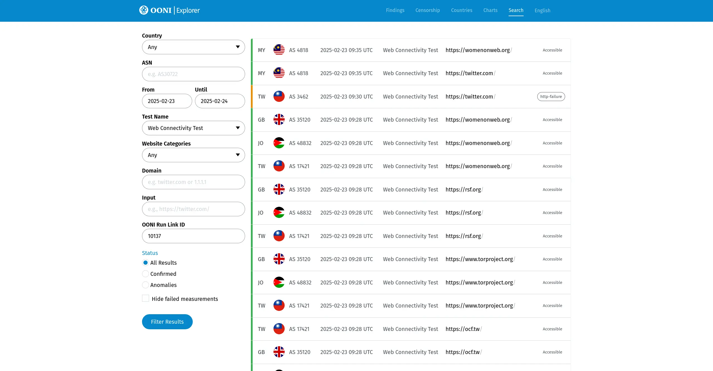

# 回顾：网络自由工作坊：Tor、Tails、OONI

[Tor/Tails、OONI 工作坊活动](./rightscon25-pre-event.md)顺利在 2025/02/23 下午与晚上时段圆满完成，无论您是否到场全程参与，都非常感谢这次参与的伙伴、志愿者与 Tor、OONI 团队！

回顾当天的活动情况，我们稍微整理成**简短摘要**与当日的**活动简报**供您参考。

活动议程：

1. 工作坊 14:00 – 17:30 如何使用 Tor 避开审查并匿名浏览
    - Raya, Education Coordinator @ The Tor Project
    - Gus, Community Team Lead @ The Tor Project

2. 工作坊 18:00 – 19:00 如何使用 OONI 侦测与观察网络审查状况
    - Elizaveta Yachmeneva, Research & Community Coordinator @ OONI
    - Maria Xynou, Director of Strategic Engagement @ OONI

3. 演讲座 19:30 – 21:00 Tor 在网络监控的世界中捍卫个人线上隐私权
    - Roger Dingledine, Co-founder of The Tor Project

<!-- more -->

## Tor/Tails 工作坊

{ style="border-radius: 5px; border: 1px solid #cdcdcd;" }

[简报下载（Google Slides）](https://docs.google.com/presentation/d/1UriBLwNR_DU5XuGufTS3RpI5CjEpjRzSFa-hhpkWaoE/edit?usp=sharing){ .md-button target="_blank" }

### 为什么需要第二台设备

可能由于预算与使用习惯的关系，私人与工作事务会在常用设备中混合使用，如在工作上处理机密信息而忽略资安防护，所要承担的数据泄漏等风险相当大。因此针对工作上或是针对某一个较为重要的环节使用第二台设备会是一个较好的选择。

常被忽略的资安防护方式：恶意程序或间谍程序会通过已知或未公开漏洞、恶意链接将跟踪器埋入设备并开启后门控制设备。

### 什么是 Tails？

Tails 是一个操作系统，可以安装在 USB 随身碟中于笔记本或桌上型电脑启动。与一般操作系统不同的地方在于每次启动都是一个全新与干净的环境，可离线使用，如需连接至互联网，一律强制通过 Tor 洋葱路由实现匿名上网。

Tails 项目启动于 2009，直到 2024 [合并](https://blog.torproject.org/tor-tails-join-forces/){target="_blank"}到 Tor Project 子项目中，共享开发与社区资源。

虽然 Tails 每次启动都是一个全新的环境，但也提供加密的存取空间方便使用，可以在启动时选择挂载该磁区，即使环境恢复到原始状态，但数据还是可以随时存取编辑。

在 Tails 中也包含许多注重安全的开源软件，进入到 Tails 后可以直接使用（方便完全离线的情境）。由于遵循[基于安全的设计](https://zh.wikipedia.org/zh-tw/%E5%9F%BA%E6%96%BC%E5%AE%89%E5%85%A8%E7%9A%84%E8%A8%AD%E8%A8%88){target="_blank"}（Security by Design），某些常用的软件可能短时间内还不能在 Tails 中使用，团队也在努力中进行调整或是改用其他的技术达到符合匿名、匿踪的条件。

Tails 当然也有不完美的部分，比如在一些较新的 Mac 电脑无法使用（主要问题是 ARM 处理器）、通过 Tor 洋葱路由网络稍微缓慢、目前还无法支持常用的[通讯软件](https://tails.net/support/faq/index.en.html#messaging){target="_blank"}（WhatsApp、Telegram、Signal），因此当你需要非常的保护情境时可以考虑使用 Tails。

### 什么是 Tor？

由于 Tails 整合 [Tor 洋葱路由](https://zh.wikipedia.org/zh-tw/%E6%B4%8B%E8%91%B1%E8%B7%AF%E7%94%B1){target="_blank"}，所有的连接都强制通过 Tor 连接至互联网。在未认识 Tor 之前，我们或许都是通过 VPN 的方式上网，但与 Tor 不同之处在于 VPN 仅是加密网络传输时的数据，VPN 服务供应商知道你是谁、从哪里连接到 VPN、也知道你连接到哪里去。甚至需要时也可以通过购买服务时的付款信息知道你是谁。

Tor 则是通过三台主机（Tor Relay），传输内容也加密三次，各分别仅知道你的一部分信息，由于 Tor Relay 都是由全球志愿者协助建立，在去中心化且多样性下，很难拼凑出你完整的信息，从而达成隐私纳入设计（[Privacy by Design](https://en.wikipedia.org/wiki/Privacy_by_design){target="_blank"}）的连接架构。

### Tor 浏览器

在 Tails 中默认的浏览器是 [Tor 浏览器](https://www.torproject.org/zh-CN/){target="_blank"}，专注于阻挡广告与追踪技术。Tor 浏览器不是要让你消失，而是让你的行为与其他人一样，隐匿在庞大的浏览记录数据中。Tor 浏览器通过对 Firefox 调整衍生而来，也是开源软件的产品之一。

### 使用 Tails

!!! warning "下载、安装 USB 随身碟"
    由于活动场地网络频宽因素，下载镜像文件与建立 Tails USB 随身碟的步骤跳过，直接使用已预先安装好的 USB 随身碟进行。建立随身碟的部分不难，可以参考官网上的[安装指引手册](https://tails.net/install/index.en.html){target="_blank"}。

在 Tor/Tails 这场工作坊的后半段，提供现场约 30 支 USB 随身碟、重启后在自己带来的电脑上使用。现场的参与者通常会面临第一个问题是，笔记本电脑如何设置从 USB 启动呢？依各品牌的电脑不同，在启动后按下 F2 或 F12 就可以选择通过 USB 启动电脑。

!!! info "或许你会感兴趣的内容"
    1. 什么是 [Tor](../../what-is-tor.md){target="_blank"}、[Tails](../../what-is-tails.md){target="_blank"}？
    2. Tor 项目与 Tails 联手合作：<https://blog.torproject.org/tor-tails-join-forces/>{target="_blank"}
    3. [Arti 项目](https://gitlab.torproject.org/tpo/core/arti){target="_blank"}，将 Tor 使用内存安全的 Rust 语言改写实施计划。
    4. Google Summer of Code 2025: <https://blog.torproject.org/tor-in-google-summer-of-code-mentorship/>{target="_blank"}

## OONI 工作坊

{ style="border-radius: 5px;" }

[简报下载（Google Slides）](https://docs.google.com/presentation/d/1KkjhtBevT5oFCNI487PK2gCZ4tXL5wTMbzxZnjj2Nro/edit?usp=sharing){ .md-button target="_blank" }

[OONI](https://ooni.org/){target="_blank"} 是一个检测网络是否有监控与审查的工具，在一些地区的网络会通过 DNS 或 IP 等阻挡方式，让一些类型的网站或服务无法使用，透过 OONI Probe 的检测与实时上传观察数据，描绘出该区域的网络封锁状况。

在这场工作坊中展示了 [OONI Run](https://run.ooni.org/){target="_blank"} 的使用方式，OONI Run 与 OONI Probe 一样都是检测网络状况，唯一不同的是 Run 可以自订检测网站名单，并分享给位于世界各地的任何人协助检测。OONI Probe 本身也有一个既定的检测名单，但由于更新与收录的流程无法做到即时调整、部署更新的方式，OONI Run 可自订名单就提供一个非常机动、弹性的方式快速检测！

OONI Run 在建立新名单时也可以指定一组关联号码（Link ID），这组关联号码可以在 OONI Explorer 上快速搜索出检测数据，方便通过简单图表辨识目前的网络状况。

[{style="border-radius: 5px; border: 1px solid #cdcdcd;"}](https://explorer.ooni.org/search?since=2025-02-23&until=2025-02-24&test_name=web_connectivity&failure=true&ooni_run_link_id=10137){target="_blank"}

!!! info "或许你会感兴趣的内容"

    1. [什么是 OONI？](../../what-is-ooni.md){target="_blank"}
    2. 活动当天建立的 OONI Run Link ID 为 [10137](https://explorer.ooni.org/chart/mat?since=2025-02-22&until=2025-03-07&time_grain=day&axis_x=measurement_start_day&test_name=web_connectivity&ooni_run_link_id=10137){target="_blank"}，可以看到临时建立的名单通过众人[协助检测](https://explorer.ooni.org/search?since=2025-02-23&until=2025-02-24&test_name=web_connectivity&failure=true&ooni_run_link_id=10137){target="_blank"}快速了解网络状况。
    3. [Probe Security Without Identification, Michele Orrù, 2025-02-20](https://ooni.org/post/2025-probe-security-without-identification/){target="_blank"}：随着 OONI 探测网络状况的增进，但也存在一些风险，例如用户可能会故意或无意地上传错误的观察数据，这可能影响 OONI 观测的可信度。文章提到攻击者可能会利用假数据来污染 OONI 的观察数据库，以试图打击平台的信任，通过增加透明度并揭露数字权利的侵害。
    4. 2024 OONI 回顾：<https://ooni.org/post/2024-year-in-review/>{target="_blank"}
    5. [于 OONI 观测数据中台湾 ASNs 状况（2023/12）](../../ooni-asns-coverage.md){target="_blank"}

## Roger's Talk

{ style="border-radius: 5px; border: 1px solid #cdcdcd;" }

[简报下载（PDF）](https://gitlab.torproject.org/ahf/onion-tex/-/blob/main/src/pandoc/arma-kaist-2025/slides-kaist25.pdf){ .md-button target="_blank" }

这场演讲请到了 Roger，Tor Project 的创办人，分享网络自由的状况以及目前 Tor 在用户隐私保护方面的努力。以下是演讲的重点整理：

1. 多元化的重要性：他提到安全性的一部分是来自于网络服务的多样化以及用户使用互联网的多样性。Roger 说明，通过像 Tor 这样的工具，不同的人（如一般用户和政治异议人士）皆可以在相同的网络平台上使用网络服务，这样不会让特定群体成为目标。此外，多样化的下载目的（例如访问被封锁的网站）让各种使用成为可能并提供了一层保护，防止特定使用被轻易识别和攻击。

2. 用户的隐私保护：Tor 的目标是让用户可以选择谁能够获取你的数据、通信的元数据，避免被刻意收集从而识别出用户。

3. 技术滥用提醒：他谈到技术有时会被不当使用或是误解，甚至在电影中对暗网有刻板印象，需要特别关注改善这样的状况。

### 未来应该要持续关注

1. 隐私法规与技术进展：需观察全球的隐私法规变化与技术进步，了解如何保护个人网络隐私。

2. 网络中立性：确保不同种类的内容与技术应用能够在网络上自由访问。

3. 教育与倡议：提高大众及政策制定者对网络自由和隐私保护重要性的认识。

### 我们可以如何行动

- 可转化的行动包括推广网络匿名工具的使用，教育用户如何保护个人隐私，以及支持或参与相关的政策倡议工作来推动合理的网络自由政策。

!!! info "或许你会感兴趣的内容"
    1. Roger 在演讲中也提到通过不同方式连接到 Tor，其中 [Snowflake](https://snowflake.torproject.org/){target="_blank"} 则是可以伪装成串流方式协助引导 Tor 用户连接。Snowflake 是参与贡献 Tor 带宽中门槛最低最方便的方式，只需要安装一个浏览器插件后开启就完成了！
    2. [Tor University Challenge - Electronic Frontier Foundation](https://toruniversity.eff.org/administrators/){target="_blank"}：来自 EFF 发起的「Tor 大学挑战赛」，其目的是鼓励更多的大学运行 Tor 中继节点，以增强 Tor 网络的稳定性和抵御审查能力。网站中提供了各类资源，协助大学管理者与技术团队设置和管理 Tor 中继节点，支持网络自由与对抗审查的努力。

---

!!! note "项目后续"
    [OONI-Research 项目](../../index.md)也将持续在台湾推广 Tor/Tails、OONI 的使用，就网络自由、网络审查的议题上继续努力。若对参与或继续接收我们的信息有兴趣，可以参考「[持续关注](../../contact.md)」的加入方式。我们预计在 2025/08 的 COSCUP 活动中举办 Tor/Tails、OONI 的工作坊，会以**华语**的方式进行，并由助教从旁协助参与者进行（暂定）。活动前我们会需要编修教材、培训等筹备准备，如果您对这项活动有兴趣参与，也欢迎参阅「[持续关注](../../contact.md)」的联络方式告知我们。
