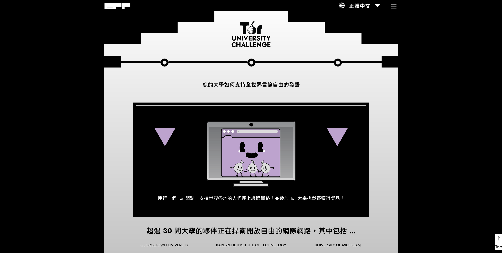

# 2025/04 项目进度更新

{style="border-radius: 10px;box-shadow:1px 1px 0.6rem #00aeff;"}

好久不见了，四月份经历了一个非常忙碌的阶段，OCF/OONI-Research 项目也稍微缓慢推进。我们翻译了一篇来自 OONI 的发布更新：[新 OONI Explorer 主题审查页面](./2025-ooni-explorer-thematic-censorship-pages.md)。

另外，我们协助 eff.org 翻译的「[Tor 大学挑战赛计划](https://toruniversity.eff.org/zh-tw/)」现已翻译完毕并顺利更新到官网上，但目前还没有足够的能量来推广这个计划，或许再找个时间想想如何推动与展开。

<!-- more -->

{style="border-radius: 5px;"}

最重要的是，预计在 2025/08 举办的「[匿名网络工作坊](../../event-workshop-2025.md)」已开始启动筹备了！

## 「匿名网络工作坊」招募工作人员与培训小助手

我们计划在今年的 COSCUP 开源人年会上举办「[匿名网络工作坊](../../event-workshop-2025.md)」，延续在 RightsCon 前的[工作坊活动](./rightscon25-pre-event.md)，这次我们会针对教材进行**翻译**与**本地化调整**，并用**华语**的方式进行。2025/08 活动前，会针对 Tor/Tails、OONI 培训小助手，在工作坊活动日可以带领现场的参与者更快了解匿名网络、网络自由的重要性。

在接下来的三个月期间，我们也需要活动策划的工作人员，协助我们协调、宣传、报名、通知等活动事宜。也欢迎害羞的新手可以通过与我们一起办活动的方式，慢慢认识我们与匿名网络、网络自由的议题。

我们针对工作坊活动建立了一个活动页面，筹备事项、时间表与未来的报名都将在这个页面呈现。这次工作坊活动主要面向的参与者希望是新闻媒体、独立记者、公民团体、科技社群的伙伴，能协助他们在日常工作时面临网络自由等严峻问题时，有一个参考的工具或解决方案。

也希望通过这次的工作坊，与对此议题感兴趣的人一起提升对于 Tor/Tails、OONI 等知识！我们设计了一个技能分级表，后续的培训希望把大家提升到 **Basic Level 3** 的层级！

[了解「匿名网络工作坊」筹备事项！](../../event-workshop-2025.md){ .md-button .md-button--primary }

如果你对工作坊筹备与培训小助手感兴趣，欢迎直接回信给我。另外，开放文化基金会的志工招募也已[同步公告](https://volunteer.ocf.tw/blog/)工作坊招募信息。
