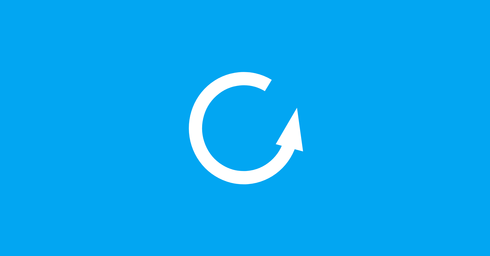

# 匿名网络工作坊进度更新

{style="border-radius: 10px;box-shadow:1px 1px 0.6rem #00aeff;"}

近期我们「匿名网络工作坊」与项目有一些进度与需要协助的事项，在此与你分享。

## 匿名网络工作坊（筹备）

上周我们已经召开了第二次[线上会议](https://pad.anoni.net/p/anoni-workshop){target="_blank"}，距离我们八月的活动也不到两个月的时间了，已经开始进行小组分工分配工作人员的任务。目前分成两个小组：活动组和文宣组，把握这两个月的时间开始准备活动报名页面和活动前的宣传事宜。我们依旧在持续招募工作人员，欢迎报名和我们一起举办这场工作坊活动。

此外，Tor/Tails 工作坊需要使用的[教材简报](https://docs.google.com/presentation/d/16XWWrSX8DqmZ9uEORiaI-jT0RpquswXFDbzvr6srYjA/edit?usp=drive_link){target="_blank"}也顺利完成翻译。**（感谢所有参与翻译的伙伴，也感谢 Tor/Tails 的 Gus 和 Zaatar）**。接下来到六月底会是我们的助教培训活动，如果你此时正好有时间，也欢迎上线与我们一起参与。在上线参与前，可以先参考「[自我技能评估表](../../setup-skill-level.md){target="_blank"}」，尝试找找可能的答案，我们会在线上课程培训时一起讨论、解答。

<!-- more -->

以下是线上培训课程时间，请自行创建日历提醒，我们都会使用相同的[线上会议链接](https://jitsi.goodmeet.asia/anoni-workshop){target="_blank"}，有空的话就一起上线吧！（预计每次 90 分钟）

- 6/14 21:00 Tor L1 ~ L3
- 6/15 13:30 Tails L1 ~ L3
- 6/15 21:00 OONI L1 ~ L3
- 6/21 21:00 Tails L1 ~ L3
- 6/28 13:30 Tor L1 ~ L3
- 6/29 13:30 OONI L1 ~ L3

对了，我们上周会议讨论到工作坊需要大量的U盘供现场参与者使用。由于我们目前还没有接受捐款的流程，但可以接受实物捐赠，如果你手头正好有闲置的U盘，非常感谢提供给我们使用，**预计征求 25 个**。这些U盘需能够安装 Tails（约 1.6 GB）并可用于开机使用即可。

## 简体中文语系支持

{style="border-radius: 10px;box-shadow:1px 1px 0.6rem #00aeff;"}

「**倡议**」就是当你想让事情变得更好，然后动手去做，并让大家一起关注、一起支持、促成真正的改变。倡议的力量是不分语言的。无论使用哪种文字，我们对改变的渴望都是相同的，因此我们提供了简体中文版（zh-CN），希望跨越文字的障碍，吸引更多人一起参与！

由于我们观察到来自**简体中文关键词**的搜索，最终导引到项目页面的比例约为 30%，这是一种很特殊的现象。既然如此，我们就顺应区域的需求，提供合适的内容！

部分内容请 ChatGPT 协助修改、加入合适的语境，但基本上还是以台湾的观点作为基本的阐述、论述。如果有兴趣拓展或是展开不同语系的合适内容，欢迎加入我们的「匿名网络」倡议！

当然，也欢迎将项目内容推荐给有需要的伙伴，感谢！

- 简体中文项目：<https://ooni-research.ocf.tw/docs/zh-cn/>{target="_blank"}

## 开源与匿名网络圆桌会议

<figure markdown="span">
  
  <figcaption>活动两日当日预计的行程表。</figcaption>
</figure>

这次我们尝试举办圆桌会议讨论形式，目前需要多多接触我们的目标对象，例如：公民团体、新闻媒体、独立记者、科技社群。如果你有认识的伙伴是我们未来要服务的对象，也请帮忙传达这次工作坊活动与圆桌会议讨论，详细内容可以参考[筹备页面](../../event-workshop-2025-prepare.md){target="_blank"}的说明！

## 最后

「**匿名网络**」的议题沿着「**网络自由**」的脉络持续发展，而个人隐私与网络浏览行为追踪（如广告）也一直是我们不断面对的挑战。这不仅是对抗这些问题，更是唤起大众对隐私的重视。「匿名网络」未来将涉及更多层面，无论是在唤起议题的认同，还是在匿名网络的基础建设与工具使用培训上，我们都期待能一步步吸引更多人参与。

因此，工作坊活动、圆桌会议讨论都希望带着你对「匿名网络」的想象，勾勒出未来社群的模样！

感谢关注！
