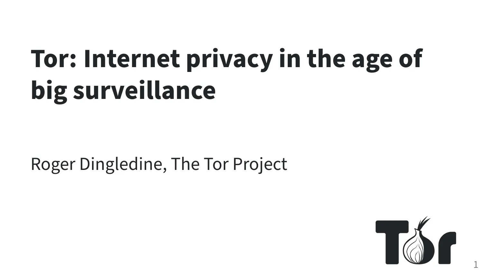

# 回顧：網路自由工作坊：Tor、Tails、OONI

[Tor/Tails、OONI 工作坊活動](./rightscon25-pre-event.md)順利在 2025/02/23 下午與晚上時段圓滿完成，無論你是否要到場全程參與，都非常感謝這次參與的夥伴、志工與 Tor、OONI 團隊！

回顧當天的活動狀況，我們稍微整理成**簡短摘要**與當日的**活動簡報**提供給你參考。

活動議程：

1. 工作坊 14:00 – 17:30 如何使用 Tor 避開審查並匿名瀏覽
    - Raya, Education Coordinator @ The Tor Project
    - Gus, Community Team Lead @ The Tor Project
2. 工作坊 18:00 – 19:00 如何使用 OONI 偵測與觀察網路審查狀況
    - Elizaveta Yachmeneva, Research & Community Coordinator @ OONI
    - Maria Xynou, Director of Strategic Engagement @ OONI
3. 演講座 19:30 – 21:00 Tor 在網路監控的世界中捍衛個人線上隱私權
    - Roger Dingledine, Co-founder of The Tor Project

<!-- more -->

## Tor/Tails 工作坊

{ style="border-radius: 5px; border: 1px solid #cdcdcd;" }

[簡報下載（Google Slides）](https://docs.google.com/presentation/d/1UriBLwNR_DU5XuGufTS3RpI5CjEpjRzSFa-hhpkWaoE/edit?usp=sharing){ .md-button target="_blank" }

### 為什麼需要第二台裝置

可能迫於預算與使用習慣的關係，私人與工作事務會在常用的裝置中混合使用，如在工作上處理機敏資訊與私人日常使用方式而忽略資安防護，所要承擔的資料外洩等風險相當大。因此針對工作上或是針對某一個較為重要的環節使用第二台裝置會是一個較好的選擇。

會忽略掉的資安防護常見的方式：惡意程式或間諜程式會透過已知或未公開漏洞、惡意連結將裝置埋入追蹤與開啟後門控制裝置。

### 什麼是 Tails？

Tails 是一個作業系統，可以安裝在 USB 隨身碟中於筆電或桌上型電腦啟動。與一般作業系統不同的地方在於每次啟動都是一個全新與乾淨的環境，可離線使用，如要連線至網際網路，一律強制透過 Tor 洋蔥路由達到匿名的方式上網。

Tails 專案啟動於 2009，直到 2024 [合併](https://blog.torproject.org/tor-tails-join-forces/){target="_blank"}到 Tor Project 子專案中，共享開發與社群資源。

雖然 Tails 每次啟動都是一個全新的環境，但也有提供加密的存取空間方便使用，可以在啟動時選擇掛載該磁區，即使環境恢復到原始狀態，但資料還是可以隨時存取編輯。

在 Tails 中也包含許多著重在安全的開源軟體，進入到 Tails 後就可以直接使用（方便完全離線的情境），由於遵循著[基於安全的設計](https://zh.wikipedia.org/zh-tw/%E5%9F%BA%E6%96%BC%E5%AE%89%E5%85%A8%E7%9A%84%E8%A8%AD%E8%A8%88){target="_blank"}（Security by Design），某些常用的軟體可能短時間內還不能在 Tails 中使用，團隊也在努力中調整或是改用其他的技術達到符合匿名、匿蹤的條件。

Tails 當然也有不完美的部分，在一些較新的 Mac 電腦無法使用（主要問題是 ARM 處理器）、透過 Tor 洋蔥路由網路稍微緩慢、目前還無法支援常用的[通訊軟體](https://tails.net/support/faq/index.en.html#messaging){target="_blank"}（WhatsApp、Telegram、Signal），也因此當你需要非常的保護情境時可以考慮使用 Tails。

### 什麼是 Tor？

由於 Tails 整合 [Tor 洋蔥路由](https://zh.wikipedia.org/zh-tw/%E6%B4%8B%E8%91%B1%E8%B7%AF%E7%94%B1){target="_blank"}，所有的連線都強制透過 Tor 連上網際網路。在未認識 Tor 之前，我們或許都是透過 VPN 的方式上網，但與 Tor 不同之處在於 VPN 僅是加密網路傳輸時的資料，VPN 服務供應商知道你是誰、從哪裡連到 VPN、也知道你連線到哪裡去。甚至需要也可以透過購買服務時的付款資訊知道真實的你，是誰。

Tor 則是透過三台主機（Tor Relay），傳輸內容也加密三次，各分別僅知道你的一部分資訊，由於 Tor Relay 都是由全球志工協助建立，在去中心化且如此之多樣性是很難拼出你完整的資訊，從而達到隱私納入設計（[Privacy by Design](https://en.wikipedia.org/wiki/Privacy_by_design){target="_blank"}）的連線架構。

### Tor 瀏覽器

在 Tails 中預設的瀏覽器是 [Tor 瀏覽器](https://www.torproject.org/zh-TW/){target="_blank"}，專注在阻擋廣告與追蹤技術，Tor 瀏覽器不是要把你變不見，而是把你的變得與其他人一樣的方式隱匿在龐大的瀏覽紀錄資料中。Tor 瀏覽器是透過 Firefox 調整參與產生的，也是來自開源軟體的產品。

### 使用 Tails

!!! warning "下載、安裝 USB 隨身碟"

    由於活動場地網路頻寬因素，下載映像檔與建立 Tails USB 隨身碟的步驟跳過，直接使用已預先安裝好的 USB 隨身碟進行。建立隨身碟的部分不難，可以參考官網上的[安裝指引手冊](https://tails.net/install/index.en.html){target="_blank"}。

在 Tor/Tails 這場工作坊的後半段，提供現場約 30 支的 USB 隨身碟、重開機後在自己帶來的電腦上使用，現場的參與者通常會面臨到第一個問題是，筆電如何設定從 USB 開機呢？依各廠牌的電腦不同，在開機後按下 F2 或 F12 就可以選擇透過 USB 啟動電腦。

!!! info "或許你會感興趣的內容"

    1. 什麼是 [Tor](../../what-is-tor.md){target="_blank"}、[Tails](../../what-is-tails.md){target="_blank"}？
    2. Tor 專案與 Tails 聯手合作：<https://blog.torproject.org/tor-tails-join-forces/>{target="_blank"}
    3. [Arti 專案](https://gitlab.torproject.org/tpo/core/arti){target="_blank"}，將 Tor 使用記憶體安全的 Rust 語言改寫實作計畫。
    4. Google Summer of Code 2025: <https://blog.torproject.org/tor-in-google-summer-of-code-mentorship/>{target="_blank"}

## OONI 工作坊

{ style="border-radius: 5px;" }

[簡報下載（Google Slides）](https://docs.google.com/presentation/d/1KkjhtBevT5oFCNI487PK2gCZ4tXL5wTMbzxZnjj2Nro/edit?usp=sharing){ .md-button target="_blank" }

[OONI](https://ooni.org/){target="_blank"} 是一個檢測網路是否有監控與審查的工具，在一些地區的網路會透過 DNS 或 IP 等阻擋方式，讓一些類型的網站或服務無法使用，透過 OONI Probe 的檢測與即時上傳觀察資料，描繪出該區域的網路封鎖狀況。

在這場工作坊中展示了 [OONI Run](https://run.ooni.org/){target="_blank"} 的使用方式，OONI Run 與 OONI Probe 一樣都是檢測網路狀況，唯一不同的在於 Run 可以自訂檢測網站名單，並分享給位在世界各地的任何人協助檢測。OONI Probe 本身也有一個既定的檢測名單，但由於更新與收錄的流程無法做到即時調整、佈署更新的方式，OONI Run 可自訂名單就提供一個非常機動、彈性的方式快速檢測！

OONI Run 在建立新的名單是也可以指定一組關聯號碼（Link ID），這組關聯號碼可以在 OONI Explorer 上快速搜尋出檢測資料，方便透過簡單圖表辨識目前的網路狀況。

{target="_blank"}

!!! info "或許你會感興趣的內容"

    1. [什麼是 OONI？](../../what-is-ooni.md){target="_blank"}
    2. 活動當天建立的 OONI Run Link ID 為 [10137](https://explorer.ooni.org/chart/mat?since=2025-02-22&until=2025-03-07&time_grain=day&axis_x=measurement_start_day&test_name=web_connectivity&ooni_run_link_id=10137){target="_blank"}，可以看到臨時建立的名單透過眾人[協助檢測](https://explorer.ooni.org/search?since=2025-02-23&until=2025-02-24&test_name=web_connectivity&failure=true){target="_blank"}快速了解網路狀況。
    3. [Probe Security Without Identification, Michele Orrù, 2025-02-20](https://ooni.org/post/2025-probe-security-without-identification/){target="_blank"}：隨著 OONI 探測網路狀況的增進，但也存在一些風險，例如使用者可能會故意或無意地上傳錯誤的觀察資料，這可能會影響 OONI 觀測的可信度。文章提到攻擊者可能會利用假資料來污染OONI 的觀察資料庫，以試圖打擊平台的信任，透過增加透明度並揭露數位權利的侵害。
    4. 2024 OONI 回顧：<https://ooni.org/post/2024-year-in-review/>{target="_blank"}
    5. [於 OONI 觀測資料中臺灣 ASNs 狀況（2023/12）](../../ooni-asns-coverage.md){target="_blank"}

## Roger's Talk

{ style="border-radius: 5px; border: 1px solid #cdcdcd;" }

[簡報下載（PDF）](https://gitlab.torproject.org/ahf/onion-tex/-/blob/main/src/pandoc/arma-kaist-2025/slides-kaist25.pdf){ .md-button target="_blank" }

這場演講請到 Roger, Tor Project 創辦人分享網路自由的狀況以及目前 Tor 在使用者隱私保護的努力，以下是這場演講的重點整理。

1. 多元化的重要性：他提到安全性的一部分是來自於網路服務的多樣化以及使用者的使用網際網路的多樣性。Roger 說明，通過像 Tor 這樣的工具，不同的人（如一般使用者和政治異議人士）皆可以在相同的網路平台上使用網路服務，這樣不會讓特定群體成為目標。此外，多樣化的下載目的（例如訪問被封鎖的網站）讓各種使用成為可能並提供了一層保護，防止特定使用被輕易識別和攻擊。
2. 使用者的隱私保護：Tor 的目標是讓使用者可以選擇誰能夠取得你的資料、通訊的 metadata，避免被刻意蒐集從而識別出使用者。
3. 技術濫用提醒：他談到技術有時會被不正當使用或是誤解，甚至在電影中常常對暗網有刻板印象，需要特別關注改善這樣的狀況。

未來應該要持續關注：

1. 隱私法規與技術進展：需觀察全球的隱私法規變化與技術進步，了解如何保護個人網路隱私。
2. 網路中立性：確保不同種類的內容與技術應用能夠在網路上自由存取。
3. 教育與倡議：提高大眾及政策制定者對網路自由和隱私保護重要性的認識。

我們可以如何行動：

- 可轉化行動包括推廣網路匿名工具的使用，教育使用者如何保護個人隱私，以及支持或參與相關的政策倡議工作來推動合理的網路自由政策。

!!! info "或許你會感興趣的內容"

    1. Roger 在演講中也提到透過不同方式連結到 Tor，其中 [Snowflake](https://snowflake.torproject.org/){target="_blank"} 則是可以偽裝成串流方式協助導引 Tor 使用者連線。Snowflake 是參與貢獻 Tor 頻寬中門檻最低最方便的方式，只需要安裝一個瀏覽器套件後開啟就完成了！
    2. [Tor University Challenge - Electronic Frontier Foundation](https://toruniversity.eff.org/administrators/){target="_blank"}：來自 EFF 發起的「Tor 大學挑戰賽」，其目的是鼓勵更多的大學運行 Tor 中繼節點，以增強 Tor 網路的穩定性和抵禦審查能力。網站中提供了各類資源，協助大學管理者與技術團隊設定和管理 Tor 中繼節點，從而支持網路自由與對抗審查的努力。
